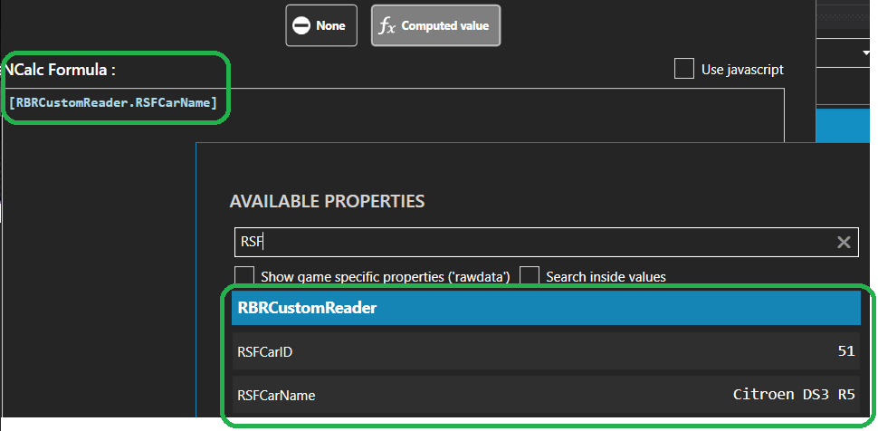

# User.RBRCustomReader

Custom Richard Burns Rally (RBR) data reader plugin for SimHub. This plugin adds new properties to be used by SimHub dashboards.

- RSFCarName = The true car name as shown in Rallysimfans (RSF) car selection screens.
- RSFCarID = RSF car ID (not the same as 0..7 car slot ID)

## SimHub addon plugin installation:
- Close SimHub application
- Download the latest _SimHubPlugin_User.RBRCustomReader_versionTag.zip_ file from Releases page (see the right frame and Releases link)
- Extract the downloaded zip file or navigate inside of it using FileExplorer to see files in the zip file
- Copy _User.RBRCustomReader.dll_ file into the SimHub application folder (ie. the folder where you have SimHubWPF.exe)
- Launch SimHub and it will probably notify you it detected a new addon plugin
  - Enable the _RBR Custom Reader_ plugin
  - No need to tick _Show in left menu_ option 
- The plugin should be now shown as enabled in _SimHub/Settings/Plugins_ tab page
 
## How to use new custom properties in SimHub dashboard layout
- Add a text object into SimHub dashboard layout and set the text object to use NCalc formula with RSFCarName or RSFCarID property reference
  - As of writing this this custom RBR reader plugin has only two new properties: RSFCarName and RSFCarID, but in the future there may be more custom properties

## License
Copyright (c) 2023 mika-n, www.rallysimfans.hu. No promises and/or warranty given what so ever. This may or may not work. Use at your own risk.

WTFPL licensed to public domain, free for commercial and personal use, modifications and redistribution allowed. http://www.wtfpl.net/

If you modify and create a derivated version using this app then please leave the above shown copyright text in the derived work as a credit to the original work (readme.txt and source code files).

